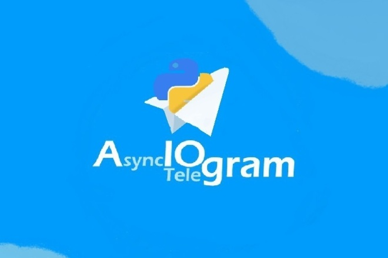

# Telegram Bot Aiogram 3.x versiyasi uchun shablon



+ Shablon aiogram `2.x` verisyasidan `3.x` versiyasi uchun o'zgartirildi
+ Qo'shimchalar qo'shildi va keraksiz qismlar olib tashlandi
+ Eski shablon [anvarnarz](https://github.com/anvarnarz/mukammal-bot-paid) dan olindi

...Shablonni quyidagi git buryug'i orqali yuklab olishingiz mumkin:
 
     
    git clone https://github.com/uzbek-coder-2022/telegram-bot-template-aiogram-verison-3.git


...Shablonni o'zingizga yuklab olgandan so'ng aiogram va environs kutubxonalarini o'rnating quyidagi buyruqlar orqali: 

  ```pip install aiogram```

  ```pip install environs```

  Yoki boshqa usul `requirements.txt` orqali bu ishni bajarishingiz ham mumkin:

  ```pip install -r requirements.txt```


 ...Qo'shimcha o'zgartirishlar asta-sekin yana amalga oshirib boriladi.

©️ Khusanboy Sobirjonov